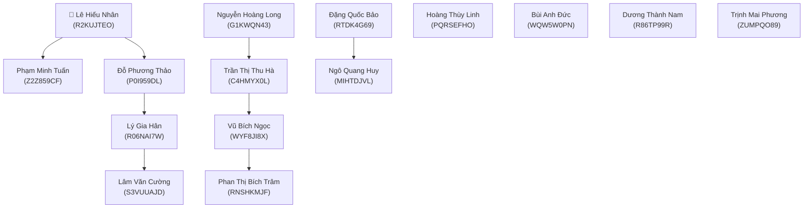

# 📋 DANH SÁCH TÀI KHOẢN & MẬT KHẨU HỆ THỐNG APEX BANK

Tài liệu này chứa thông tin đăng nhập và hồ sơ eKYC thực tế của toàn bộ **15 tài khoản hệ thống** (1 Quản trị viên + 14 Khách hàng).

---

## 👑 1. TÀI KHOẢN QUẢN TRỊ VIÊN (ADMIN)

> [!NOTE]
> Khi đăng nhập bằng tài khoản này, hệ thống sẽ tự động chuyển vào giao diện **Bảng Quản Trị Viên (Admin Portal)** để giám sát toàn bộ danh sách 15 tài khoản và tìm kiếm khách hàng.

| Trường thông tin | Chi tiết |
|:---|:---|
| **Email đăng nhập** | `hieunhan.2709@gmail.com` |
| **Mật khẩu** | `@LHNhan27092005` |
| **Vai trò (Role)** | `admin` |
| **Họ và tên** | **Lê Hiếu Nhân** |
| **Số CCCD** | `079205027909` |
| **Số điện thoại** | `0908270905` |
| **Địa chỉ thường trú** | Số 27 Đường Nguyễn Huệ, Phường Bến Nghé, Quận 1, TP. Hồ Chí Minh |
| **Mã giới thiệu của tôi** | `R2KUJTEO` |

---

## 👥 2. DANH SÁCH 14 TÀI KHOẢN KHÁCH HÀNG (USER)

> [!TIP]
> **Mật khẩu chung cho tất cả 14 tài khoản khách hàng:** `Password@123`

| STT | Họ và tên | Email đăng nhập | Mật khẩu | CCCD (12 số) | SĐT (10 số) | Địa chỉ thường trú | Mã GT | Người GT |
|:---:|:---|:---|:---:|:---:|:---:|:---|:---:|:---:|
| 1 | **Nguyễn Hoàng Long** | `nguyenhoanglong.bank@gmail.com` | `Password@123` | `001095012345` | `0912345678` | Số 45 Phố Tràng Tiền, P. Tràng Tiền, Q. Hoàn Kiếm, TP. Hà Nội | `G1KWQN43` | — |
| 2 | **Trần Thị Thu Hà** | `tranthithuha.fin@gmail.com` | `Password@123` | `079198023456` | `0903456789` | Số 128 Đường Hai Bà Trưng, P. Đa Kao, Q. 1, TP. HCM | `C4HMYX0L` | `G1KWQN43` |
| 3 | **Phạm Minh Tuấn** | `phamminhtuan.dev@gmail.com` | `Password@123` | `048092034567` | `0935123456` | Số 88 Đường Bạch Đằng, P. Hải Châu 1, Q. Hải Châu, TP. Đà Nẵng | `Z2Z859CF` | `R2KUJTEO` |
| 4 | **Vũ Bích Ngọc** | `vubichngoc.hcm@gmail.com` | `Password@123` | `079196045678` | `0978654321` | Số 215 Đường Nguyễn Đình Chiểu, P. Võ Thị Sáu, Q. 3, TP. HCM | `WYF8JI8X` | `C4HMYX0L` |
| 5 | **Đặng Quốc Bảo** | `dangquocbao.tech@gmail.com` | `Password@123` | `001098056789` | `0868112233` | Số 68 Đường Cầu Giấy, P. Quan Hoa, Q. Cầu Giấy, TP. Hà Nội | `RTDK4G69` | — |
| 6 | **Hoàng Thùy Linh** | `hoangthuylinh.vn@gmail.com` | `Password@123` | `031194067890` | `0919887766` | Số 15 Đường Điện Biên Phủ, P. Máy Tơ, Q. Ngô Quyền, TP. Hải Phòng | `PQRSEFHO` | — |
| 7 | **Bùi Anh Đức** | `buianhduc.finance@gmail.com` | `Password@123` | `092097078901` | `0945998877` | Số 54 Đường 30 Tháng 4, P. An Phú, Q. Ninh Kiều, TP. Cần Thơ | `WQW5W0PN` | — |
| 8 | **Đỗ Phương Thảo** | `dophuongthao.biz@gmail.com` | `Password@123` | `079199089012` | `0909123890` | Số 16 Đường Thảo Điền, P. Thảo Điền, TP. Thủ Đức, TP. HCM | `P0I959DL` | `R2KUJTEO` |
| 9 | **Ngô Quang Huy** | `ngoquanghuy.apex@gmail.com` | `Password@123` | `001091090123` | `0983223344` | Số 102 Phố Kim Mã, P. Kim Mã, Q. Ba Đình, TP. Hà Nội | `MIHTDJVL` | `RTDK4G69` |
| 10 | **Lý Gia Hân** | `lygiahan.sg@gmail.com` | `Password@123` | `079301011234` | `0938556677` | Số 350 Đường Võ Văn Kiệt, P. Cô Giang, Q. 1, TP. HCM | `R06NAI7W` | `P0I959DL` |
| 11 | **Dương Thành Nam** | `duongthanhnam.bd@gmail.com` | `Password@123` | `074093022345` | `0913778899` | Số 79 Đường Đại lộ Bình Dương, P. Phú Hòa, TP. Thủ Dầu Một, Tỉnh Bình Dương | `R86TP99R` | — |
| 12 | **Trịnh Mai Phương** | `trinhmaiphuong.dna@gmail.com` | `Password@123` | `048197033456` | `0905667788` | Số 12 Đường Nguyễn Văn Linh, P. Nam Dương, Q. Hải Châu, TP. Đà Nẵng | `ZUMPQO89` | — |
| 13 | **Lâm Văn Cường** | `lamvancuong.vt@gmail.com` | `Password@123` | `077090044567` | `0977889900` | Số 204 Đường Ba Cu, P. 3, TP. Vũng Tàu, Tỉnh Bà Rịa - Vũng Tàu | `S3VUUAJD` | `R06NAI7W` |
| 14 | **Phan Thị Bích Trâm** | `phanthibichtram.hcm@gmail.com` | `Password@123` | `079195055678` | `0989334455` | Số 88 Đường Phan Xích Long, P. 2, Q. Phú Nhuận, TP. HCM | `RNSHKMJF` | `WYF8JI8X` |

---

## 🌳 3. SƠ ĐỒ MẠNG LƯỚI GIỚI THIỆU (REFERRAL NETWORK)

---

## 🔒 4. QUY TẮC BẢO MẬT & RÀNG BUỘC HỆ THỐNG

1. **Mã giới thiệu cá nhân (`ma_gioi_thieu`)**:
   - Được hệ thống tự động sinh ngẫu nhiên gồm đúng **8 ký tự** in hoa chữ & số khi tạo tài khoản.
   - Là duy nhất và **không thể sửa đổi**.
2. **Mã người giới thiệu (`ma_nguoi_gioi_thieu`)**:
   - Chỉ được liên kết **1 lần duy nhất**. Sau khi liên kết, mã được cố định vĩnh viễn và không thể thay đổi qua giao diện người dùng.
   - Không thể tự nhập mã giới thiệu của chính mình.
   - Khi tài khoản người giới thiệu bị xóa khỏi hệ thống, các tài khoản được người đó giới thiệu sẽ tự động được chuyển trường `ma_nguoi_gioi_thieu` về `NULL` qua Database Trigger.
3. **Đổi mật khẩu**:
   - Người dùng có thể đổi mật khẩu bất kỳ lúc nào tại tab **Đổi mật khẩu** trong User Dashboard. Mật khẩu mới yêu cầu tối thiểu **6 ký tự**.
