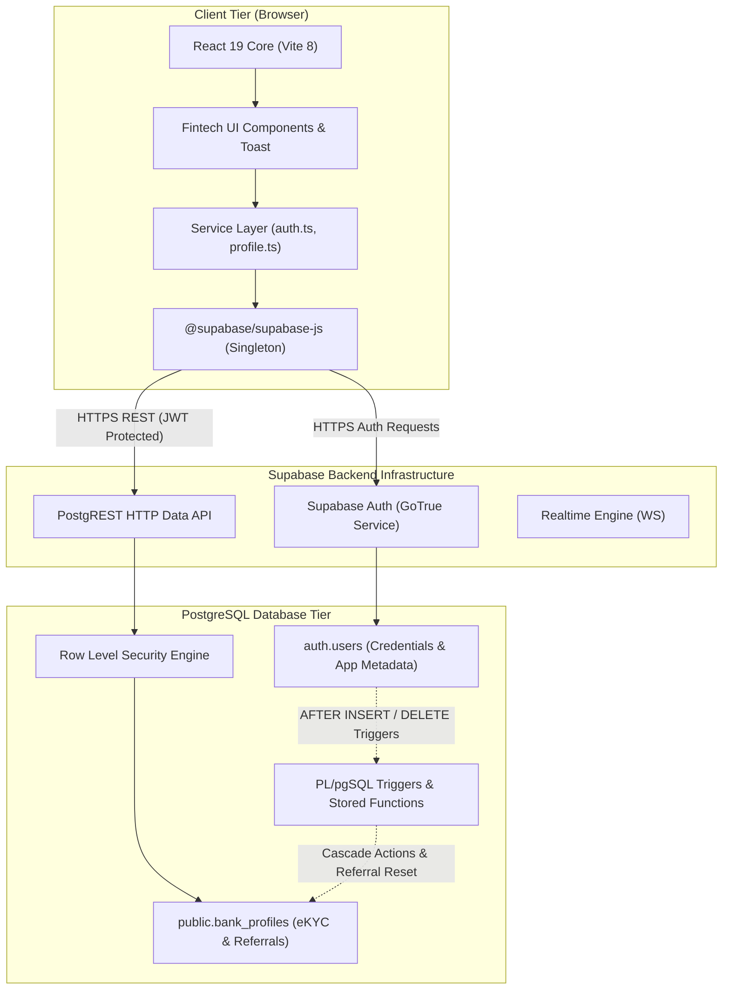
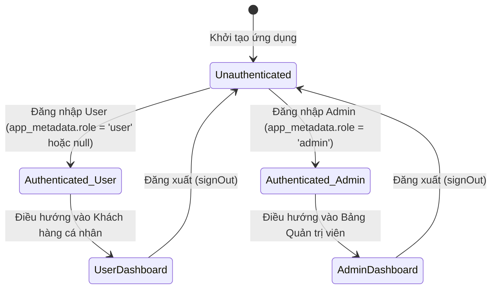

# 🏗️ ARCHITECTURE — Kiến Trúc Hệ Thống & Bảo Mật

> Tài liệu kỹ thuật chi tiết về kiến trúc tổng thể, mô hình phân tầng, cơ chế phân quyền kiểm soát truy cập (RBAC), và ma trận chính sách bảo mật Row Level Security (RLS) của hệ thống **APEX Banking**.

---

## 📑 Mục Lục

- [1. Mô Hình Kiến Trúc Tổng Thể](#1-mô-hình-kiến-trúc-tổng-thể)
- [2. Cấu Trúc Phân Tầng (Layered Architecture)](#2-cấu-trúc-phân-tầng-layered-architecture)
- [3. Phân Quyền Kiểm Soát Truy Cập (RBAC)](#3-phân-quyền-kiểm-soát-truy-cập-rbac)
- [4. Ma Trận Bảo Mật Row Level Security (RLS)](#4-ma-trận-bảo-mật-row-level-security-rls)
- [5. Quản Lý State & Vòng Đời Dữ Liệu (State Lifecycle)](#5-quản-lý-state--vòng-đời-dữ-liệu-state-lifecycle)
- [6. Nguyên Tắc Bảo Mật & Chống Giả Mạo](#6-nguyên-tắc-bảo-mật--chống-giả-mạo)

---

## 1. Mô Hình Kiến Trúc Tổng Thể

Hệ thống được xây dựng theo mô hình **Single Page Application (SPA)** hiện đại kết hợp với kiến trúc **Backend-as-a-Service (BaaS)** dựa trên nền tảng Supabase:



---

## 2. Cấu Trúc Phân Tầng (Layered Architecture)

Mã nguồn được tổ chức nghiêm ngặt theo 4 tầng độc lập nhằm đảm bảo tính phân tách trách nhiệm (Separation of Concerns):

| Tầng (Layer) | Thư mục | Trách nhiệm chính | Thành phần tiêu biểu |
|:---|:---|:---|:---|
| **1. Presentation Layer** | `src/components/`, `src/App.tsx` | Quản lý giao diện, nhận input từ người dùng, validation cục bộ, hiển thị trạng thái và xử lý thông báo. | `AuthForm.tsx`, `UserDashboard.tsx`, `AdminDashboard.tsx`, `Toast.tsx` |
| **2. Service Layer** | `src/services/` | Đóng gói logic nghiệp vụ, gọi API Supabase, chuyển đổi dữ liệu và chuẩn hóa lỗi (Error Normalization). | `auth.ts`, `profile.ts` |
| **3. Infrastructure Layer** | `src/lib/`, `src/types/` | Cấu hình kết nối client duy nhất (Singleton), định nghĩa kiểu dữ liệu tĩnh TypeScript. | `supabase.ts`, `bank-profile.ts` |
| **4. Database Engine Layer** | PostgreSQL (Supabase) | Lưu trữ dữ liệu quan hệ, thực thi kiểm soát truy cập RLS, xử lý trigger cascade và hàm thủ tục PL/pgSQL. | `bank_profiles`, `check_bank_profile_updates()`, `handle_bank_profile_deleted()` |

---

## 3. Phân Quyền Kiểm Soát Truy Cập (RBAC)

Hệ thống áp dụng mô hình phân quyền dựa trên vai trò (**Role-Based Access Control - RBAC**):



### Nguyên tắc xác định Vai trò:
*   **Vị trí lưu trữ quyền:** Quyền của tài khoản được lưu độc quyền tại `raw_app_meta_data.role` trong bảng `auth.users`.
*   **JWT Claim:** Khi đăng nhập thành công, Supabase GoTrue mã hóa `app_metadata.role` vào Access Token (JWT).
*   **Hàm kiểm tra tại Client:**
    ```typescript
    // src/services/auth.ts
    export function getRole(user: { app_metadata?: Record<string, unknown> }): "admin" | "user" {
      return user.app_metadata?.role === "admin" ? "admin" : "user";
    }
    ```
*   **Chống sửa quyền từ phía Client:** Người dùng bình thường chỉ có thể chỉnh sửa `raw_user_meta_data` (qua `updateUser({ data: ... })`). Trường `raw_app_meta_data` chỉ có thể được gán thông qua Stored Procedure quyền lực cao (`SECURITY DEFINER`) hoặc Supabase Service Role Key.

---

## 4. Ma Trận Bảo Mật Row Level Security (RLS)

Bảng `public.bank_profiles` được bảo vệ 100% bởi các chính sách RLS tại tầng Cơ sở dữ liệu:

| Tên Policy | Thao tác (Command) | Target Role | Điều kiện kiểm tra (`USING` / `WITH CHECK`) | Mục đích bảo mật |
|:---|:---:|:---:|:---|:---|
| `Users can view own profile` | `SELECT` | `authenticated` | `(SELECT auth.uid()) = user_id` | Khách hàng chỉ được đọc hồ sơ của chính mình. |
| `Users can update own profile` | `UPDATE` | `authenticated` | `USING ((SELECT auth.uid()) = user_id)`<br>`WITH CHECK ((SELECT auth.uid()) = user_id)` | Khách hàng chỉ được cập nhật hồ sơ của chính mình, không được đổi chủ sở hữu `user_id`. |
| `Users can insert own profile` | `INSERT` | `authenticated` | `WITH CHECK ((SELECT auth.uid()) = user_id)` | Ngăn chặn chèn hồ sơ mạo danh `user_id` khác. |
| `Admins can view all profiles` | `SELECT` | `authenticated` | `(((auth.jwt() -> 'app_metadata'::text) ->> 'role'::text) = 'admin'::text)` | Quản trị viên được quyền truy vấn toàn bộ 15 hồ sơ khách hàng. |

> [!IMPORTANT]
> **Anonymous Role (`anon`)**: Người dùng chưa đăng nhập hoàn toàn không có bất kỳ quyền `SELECT`, `INSERT`, `UPDATE` hay `DELETE` nào trên bảng `bank_profiles`. Mọi request nặc danh sẽ trả về mảng rỗng `[]` hoặc mã lỗi `401 Unauthorized`.

---

## 5. Quản Lý State & Vòng Đời Dữ Liệu (State Lifecycle)

Hệ thống tận dụng cơ chế State-driven router gọn nhẹ tại [src/App.tsx](file:///Users/gbao/Code/Frontend/NextJS/apex-bank/src/App.tsx):

1. **Khởi tạo (Mounting):**
   * Gọi `supabase.auth.getUser()` để kiểm tra phiên đăng nhập đã lưu trong `localStorage`.
   * Đăng ký Event Listener `supabase.auth.onAuthStateChange((event, session) => {...})`.
2. **Khi phiên làm việc thay đổi (Auth Event):**
   * Sự kiện `SIGNED_IN`: Lưu `user` vào state $\rightarrow$ Tính toán `role` $\rightarrow$ Render Dashboard tương ứng.
   * Sự kiện `SIGNED_OUT`: Đặt `user = null` $\rightarrow$ Render `AuthForm.tsx`.
   * Sự kiện `TOKEN_REFRESHED`: Tự động cập nhật Access Token trong nền mà không làm gián đoạn trải nghiệm người dùng.
3. **Hủy đăng ký (Unmounting):**
   * Thực thi `subscription.unsubscribe()` khi `App.tsx` unmount để tránh rò rỉ bộ nhớ (Memory Leaks).

---

## 6. Nguyên Tắc Bảo Mật & Chống Giả Mạo

1. **Bảo mật API Keys:**
   * Chỉ công khai `VITE_SUPABASE_ANON_KEY` và `VITE_SUPABASE_URL` lên Client.
   * **Tuyệt đối không** nhúng `SERVICE_ROLE_KEY` vào mã nguồn Frontend.
2. **Khóa Định Danh Ngân Hàng (CCCD Immutability):**
   * Input CCCD bị khóa cứng (`disabled`) trên giao diện người dùng.
   * Tầng Database không cho phép update CCCD sau khi đã hoàn tất eKYC.
3. **Bảo vệ Stored Functions:**
   * Toàn bộ hàm Trigger `SECURITY DEFINER` (`handle_bank_profile_deleted()`, `handle_auth_user_deleted()`) đã được thu hồi quyền `EXECUTE` khỏi `public`, `anon`, `authenticated` để ngăn chặn việc bị gọi trực tiếp qua PostgREST RPC.
