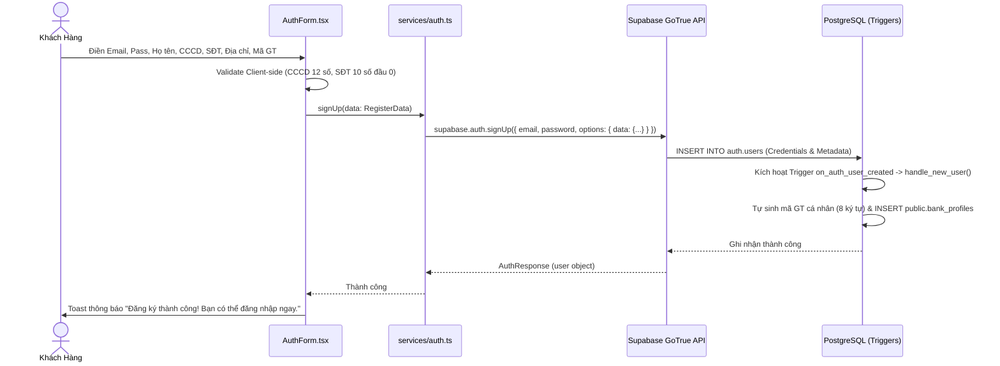

# 🔑 AUTHENTICATION — Xác Thực & Quản Lý Phiên Làm Việc

> Tài liệu kỹ thuật chi tiết về cơ chế xác thực người dùng, luồng định danh eKYC, phân tách Metadata bảo mật, và hướng dẫn xử lý các lỗi xác thực thường gặp trong hệ thống **APEX Banking**.

---

## 📑 Mục Lục

- [1. Tổng Quan Cơ Chế Xác Thực Supabase Auth](#1-tổng-quan-cơ-chế-xác-thực-supabase-auth)
- [2. Quy Trình Đăng Ký & Định Danh eKYC](#2-quy-trình-đăng-ký--định-danh-ekyc)
- [3. Quy Trình Đăng Nhập & Quản Lý Session](#3-quy-trình-đăng-nhập--quản-lý-session)
- [4. Phân Tách `user_metadata` vs `app_metadata`](#4-phân-tách-user_metadata-vs-app_metadata)
- [5. Quy Trình Đổi Mật Khẩu](#5-quy-trình-đổi-mật-khẩu)
- [6. Xử Lý Sự Cố: Lỗi "Database error querying schema"](#6-xử-lý-sự-cố-lỗi-database-error-querying-schema)

---

## 1. Tổng Quan Cơ Chế Xác Thực Supabase Auth

Hệ thống sử dụng **Supabase Auth (GoTrue Engine)** để quản lý danh tính người dùng. Các tính năng chính bao gồm:
*   Mã hóa mật khẩu an toàn theo thuật toán **bcrypt (Blowfish)**.
*   Cấp phát **JWT Access Token** (thời hạn 1 giờ) và **Refresh Token** tự động xoay vòng (Rotated Refresh Tokens).
*   Lưu trữ phiên làm việc an toàn trong `localStorage` của trình duyệt.
*   Cơ chế lắng nghe sự kiện thời gian thực `onAuthStateChange`.

---

## 2. Quy Trình Đăng Ký & Định Danh eKYC

Khi người dùng mở tài khoản mới tại form đăng ký:



### Mã nguồn xử lý tại `src/services/auth.ts`:

```typescript
export async function signUp(data: RegisterData) {
  const { data: authData, error: authError } = await supabase.auth.signUp({
    email: data.email,
    password: data.password,
    options: {
      data: {
        ho_ten: data.hoTen,
        cccd: data.cccd,
        sdt: data.sdt,
        dia_chi: data.diaChi,
        ma_nguoi_gioi_thieu: data.maNguoiGioiThieu ? data.maNguoiGioiThieu.trim().toUpperCase() : null,
      },
    },
  });

  if (authError) {
    throw new Error(authError.message);
  }

  if (!authData.user) {
    throw new Error("Không thể tạo tài khoản");
  }

  return authData;
}
```

---

## 3. Quy Trình Đăng Nhập & Quản Lý Session

Khi người dùng thực hiện đăng nhập:

```typescript
export async function signIn(email: string, password: string) {
  const { data, error } = await supabase.auth.signInWithPassword({
    email,
    password,
  });

  if (error) {
    throw new Error(error.message);
  }

  return data;
}
```

### Lắng nghe thay đổi trạng thái phiên (`src/App.tsx`):
```typescript
useEffect(() => {
  // 1. Kiểm tra session hiện tại khi mở web
  supabase.auth.getUser().then(({ data: { user } }) => {
    setUser(user);
    setLoading(false);
  });

  // 2. Lắng nghe các sự kiện SIGNED_IN, SIGNED_OUT, TOKEN_REFRESHED
  const {
    data: { subscription },
  } = supabase.auth.onAuthStateChange((_event, session) => {
    setUser(session?.user ?? null);
  });

  return () => subscription.unsubscribe();
}, []);
```

---

## 4. Phân Tách `user_metadata` vs `app_metadata`

Trong kiến trúc bảo mật của Supabase:

| Tiêu chí | `raw_user_meta_data` (`user_metadata`) | `raw_app_meta_data` (`app_metadata`) |
|:---|:---|:---|
| **Mục đích** | Lưu thông tin cá nhân của người dùng (Họ tên, CCCD, SĐT, Địa chỉ). | Lưu quyền hạn hệ thống, vai trò phân quyền (`role: "admin"`). |
| **Quyền ghi từ Client** | ✅ Cho phép người dùng chỉnh sửa qua `updateUser({ data: ... })`. | ❌ **Không cho phép**. Client không thể tự ý sửa đổi. |
| **Sử dụng trong RLS** | ❌ **Tuyệt đối không dùng** (vì người dùng có thể giả mạo). | ✅ **An toàn 100%** (Được bảo vệ và xác thực qua JWT của Supabase). |
| **Cách cấp quyền Admin** | Không dùng cho quyền Admin. | Cấp qua SQL trực tiếp hoặc Stored Procedure (`promote_user_to_admin`). |

### Stored Procedure cấp quyền Admin:
```sql
CREATE OR REPLACE FUNCTION promote_user_to_admin(p_email text)
RETURNS text AS $$
DECLARE
  v_count int;
BEGIN
  UPDATE auth.users
  SET raw_app_meta_data = COALESCE(raw_app_meta_data, '{}'::jsonb) || '{"role": "admin"}'::jsonb,
      email_confirmed_at = COALESCE(email_confirmed_at, now())
  WHERE email = p_email;

  GET DIAGNOSTICS v_count = ROW_COUNT;
  IF v_count = 0 THEN
    RETURN 'Không tìm thấy tài khoản với email: ' || p_email;
  ELSE
    RETURN 'Đã cấp quyền Admin thành công cho: ' || p_email;
  END IF;
END;
$$ LANGUAGE plpgsql SECURITY DEFINER;
```

---

## 5. Quy Trình Đổi Mật Khẩu

Người dùng đã đăng nhập có thể đổi mật khẩu tại Tab **Đổi mật khẩu**:

```typescript
export async function changePassword(newPassword: string) {
  const { error } = await supabase.auth.updateUser({
    password: newPassword,
  });

  if (error) {
    throw new Error(error.message);
  }
}
```

*   Yêu cầu mật khẩu mới tối thiểu **6 ký tự**.
*   Supabase tự động băm lại mật khẩu với salt mới và vô hiệu hóa các Access Token cũ nếu cần.

---

## 6. Xử Lý Sự Cố: Lỗi "Database error querying schema"

### Nguyên nhân:
Lỗi này (mã HTTP 500 từ GoTrue) xảy ra khi thư viện Go database driver của Supabase Auth quét dữ liệu từ bảng `auth.users` nhưng gặp phải giá trị `NULL` tại các cột token dạng chuỗi (`confirmation_token`, `recovery_token`, `email_change_token_new`, `email_change`, `phone_change`, v.v.). Go không hỗ trợ convert `NULL` thành `string` struct field nếu cột đó không được định nghĩa là nullable trong driver.

### Cách khắc phục chuẩn:
Chạy câu lệnh SQL sau trong **Supabase SQL Editor** để chuẩn hóa toàn bộ các trường token về chuỗi rỗng `''`:

```sql
UPDATE auth.users
SET 
  confirmation_token = COALESCE(confirmation_token, ''),
  recovery_token = COALESCE(recovery_token, ''),
  email_change_token_new = COALESCE(email_change_token_new, ''),
  email_change = COALESCE(email_change, ''),
  phone_change = COALESCE(phone_change, ''),
  phone_change_token = COALESCE(phone_change_token, ''),
  email_change_token_current = COALESCE(email_change_token_current, ''),
  reauthentication_token = COALESCE(reauthentication_token, '')
WHERE 
  confirmation_token IS NULL OR
  recovery_token IS NULL OR
  email_change_token_new IS NULL OR
  email_change IS NULL;
```
