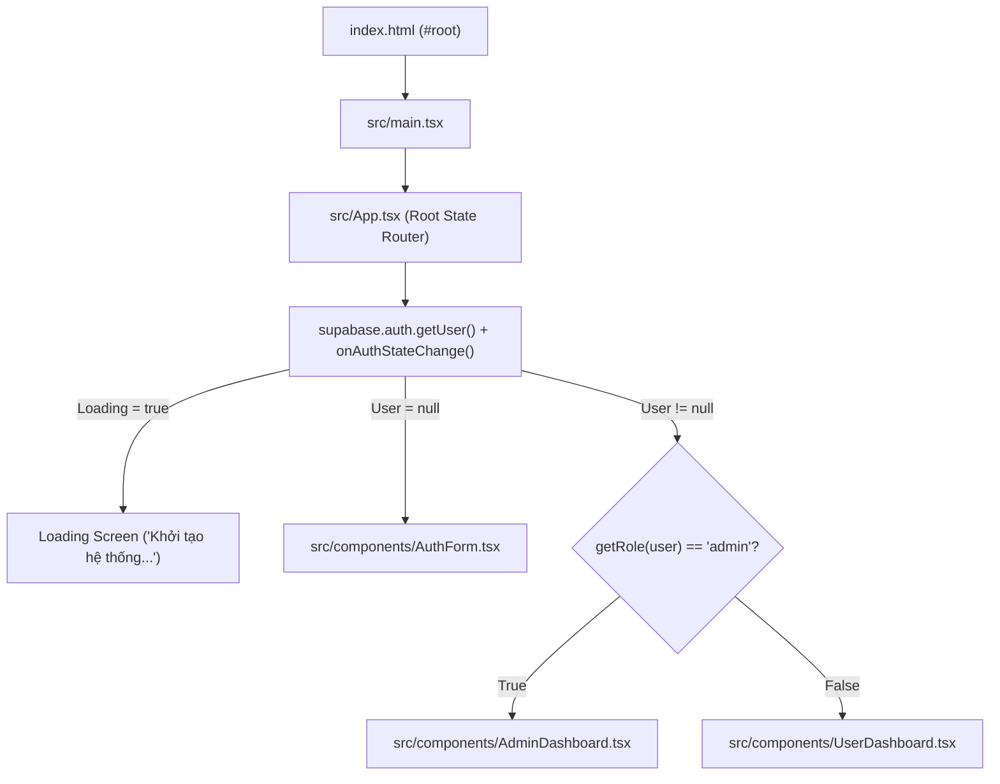

# 🗺️ PROJECT MAP — Sơ Đồ Ánh Xạ Luồng Thực Thi

> Tài liệu này mô tả chi tiết bản đồ luồng thực thi (Execution Map) của hệ thống **APEX Banking**: từ trạng thái giao diện người dùng $\rightarrow$ Components $\rightarrow$ Event Handlers $\rightarrow$ Tầng Dịch vụ (Services) $\rightarrow$ Supabase API / RPC $\rightarrow$ Thực thể Cơ sở dữ liệu (PostgreSQL).

---

## 📑 Mục Lục

- [1. Sơ Đồ Khởi Động & Điều Hướng Giao Diện](#1-sơ-đồ-khởi-động--điều-hướng-giao-diện)
- [2. Luồng 1: Đăng Nhập & Phân Quyền Vai Trò](#2-luồng-1-đăng-nhập--phân-quyền-vai-trò)
- [3. Luồng 2: Đăng Ký Mở Tài Khoản eKYC](#3-luồng-2-đăng-ký-mở-tài-khoản-ekyc)
- [4. Luồng 3: Xem & Cập Nhật Hồ Sơ Khách Hàng](#4-luồng-3-xem--cập-nhật-hồ-sơ-khách-hàng)
- [5. Luồng 4: Đổi Mật Khẩu Đăng Nhập](#5-luồng-4-đổi-mật-khẩu-đăng-nhập)
- [6. Luồng 5: Xác Thực & Liên Kết Mã Người Giới Thiệu](#6-luồng-5-xác-thực--liên-kết-mã-người-giới-thiệu)
- [7. Luồng 6: Quản Trị Viên Giám Sát & Lọc Dữ Liệu](#7-luồng-6-quản-trị-viên-giám-sát--lọc-dữ-liệu)
- [8. Luồng 7: Xóa Tài Khoản Cascade & Reset Mã Giới Thiệu](#8-luồng-7-xóa-tài-khoản-cascade--reset-mã-giới-thiệu)

---

## 1. Sơ Đồ Khởi Động & Điều Hướng Giao Diện



---

## 2. Luồng 1: Đăng Nhập & Phân Quyền Vai Trò

```text
[Giao diện Đăng nhập]
  ↓ Form Submit: email, password
[Component: AuthForm.tsx]
  ↓ handleSubmit(e) -> validate()
[Service: src/services/auth.ts -> signIn(email, password)]
  ↓
[Supabase Client: supabase.auth.signInWithPassword({ email, password })]
  ↓
[Supabase Auth (GoTrue Service)]
  ↓ Query xác thực mật khẩu bcrypt
[PostgreSQL Table: auth.users]
  ↓ Trả về AuthToken & User Session (kèm raw_app_meta_data.role)
[App.tsx onAuthStateChange Listener]
  ↓ setUser(session.user) -> getRole(user)
[Điều hướng hiển thị: AdminDashboard hoặc UserDashboard]
```

---

## 3. Luồng 2: Đăng Ký Mở Tài Khoản eKYC

```text
[Giao diện Đăng ký: Tab 'Đăng ký tài khoản']
  ↓ Form Submit: email, password, hoTen, cccd, sdt, diaChi, maNguoiGioiThieu
[Component: AuthForm.tsx]
  ↓ handleSubmit(e) -> validate() (CCCD 12 số, SĐT 10 số đầu 0, Tên >= 2 ký tự)
[Service: src/services/auth.ts -> signUp(RegisterData)]
  ↓
[Supabase Client: supabase.auth.signUp({ email, password, options: { data: {...} } })]
  ↓
[PostgreSQL Table: auth.users (INSERT row)]
  ↓ Kích hoạt Trigger: on_auth_user_created (AFTER INSERT)
[Database Function: handle_new_user()]
  ↓ Gọi hàm sinh mã ngẫu nhiên: generate_referral_code() -> 8 ký tự
  ↓ Kiểm tra tính hợp lệ của ma_nguoi_gioi_thieu (nếu có)
[PostgreSQL Table: public.bank_profiles (INSERT row)]
  ↓
[AuthForm.tsx: setSuccess(...) -> resetForm() -> switchMode('login')]
```

---

## 4. Luồng 3: Xem & Cập Nhật Hồ Sơ Khách Hàng

```text
[Giao diện: UserDashboard.tsx]
  ↓
  ├── Xem thông tin (Tab 'Thông tin tài khoản'):
  │     ↓ useEffect() -> loadProfile()
  │   [Service: src/services/profile.ts -> getMyProfile()]
  │     ↓ supabase.from('bank_profiles').select('*').eq('user_id', user.id).single()
  │     ↓ (Được bảo vệ bởi RLS: 'Users can view own profile')
  │   [Hiển thị eKYC, Số CCCD, SĐT, Địa chỉ, Mã cá nhân, Người GT]
  │
  └── Chỉnh sửa thông tin (Tab 'Chỉnh sửa thông tin'):
        ↓ Form Submit: editHoTen, editSdt, editDiaChi (CCCD bị DISABLED)
      [Component: UserDashboard.tsx -> handleUpdate(e)]
        ↓ validate() -> setSavingProfile(true)
      [Service: src/services/profile.ts -> updateProfile(id, updates)]
        ↓ supabase.from('bank_profiles').update(updates).eq('id', id).select().single()
        ↓ (Được bảo vệ bởi RLS: 'Users can update own profile')
      [PostgreSQL Trigger: trigger_check_bank_profile_updates]
        ↓ Kiểm tra không cho phép sửa ma_gioi_thieu hoặc ma_nguoi_gioi_thieu
      [Cập nhật state profile -> Chuyển về Tab Info -> Hiển thị Toast thành công]
```

---

## 5. Luồng 4: Đổi Mật Khẩu Đăng Nhập

```text
[Giao diện: UserDashboard.tsx (Tab 'Đổi mật khẩu')]
  ↓ Form Submit: newPassword, confirmPassword
[Component: UserDashboard.tsx -> handleChangePassword(e)]
  ↓ validate(): newPassword >= 6 ký tự, newPassword === confirmPassword
[Service: src/services/auth.ts -> changePassword(newPassword)]
  ↓
[Supabase Client: supabase.auth.updateUser({ password: newPassword })]
  ↓
[Supabase Auth (GoTrue Service)]
  ↓ Hash mật khẩu mới bằng bcrypt & cập nhật encrypted_password
[PostgreSQL Table: auth.users]
  ↓
[UserDashboard.tsx: Toast success 'Đổi mật khẩu thành công!' -> Chuyển về Tab Info]
```

---

## 6. Luồng 5: Xác Thực & Liên Kết Mã Người Giới Thiệu

```text
[Giao diện: UserDashboard.tsx -> Khung '🎁 Nhập mã người giới thiệu']
  ↓ Form Submit: inputInviterCode (8 ký tự)
[Component: UserDashboard.tsx -> handleLinkInviter(e)]
  ↓ Kiểm tra: code !== profile.ma_gioi_thieu (Chống tự nhập mã của mình)
[Service: src/services/profile.ts -> verifyReferralCode(code)]
  ↓ supabase.rpc('verify_referral_code', { code })
[Database Stored Procedure: verify_referral_code(code)]
  ↓ SELECT ho_ten, ma_gioi_thieu FROM public.bank_profiles WHERE ma_gioi_thieu = UPPER(code)
  ↓ Trả về: { valid: true/false, owner_name: '...', message: '...' }
  │
  ├── Nếu không hợp lệ -> Hiển thị Toast lỗi
  └── Nếu hợp lệ -> Tiếp tục gọi linkReferralCode:
        ↓ [Service: src/services/profile.ts -> linkReferralCode(id, code)]
        ↓ supabase.from('bank_profiles').update({ ma_nguoi_gioi_thieu: code }).eq('id', id)
      [Database Trigger: trigger_check_bank_profile_updates]
        ↓ Xác nhận ma_nguoi_gioi_thieu trước đó là NULL và mã hợp lệ
      [UserDashboard.tsx: Ẩn box nhập mã -> Hiện badge 'Đã liên kết • Cố định' -> Toast success]
```

---

## 7. Luồng 6: Quản Trị Viên Giám Sát & Lọc Dữ Liệu

```text
[Giao diện: AdminDashboard.tsx]
  ↓ useEffect() -> loadProfiles()
[Service: src/services/profile.ts -> getAllProfiles()]
  ↓ supabase.from('bank_profiles').select('*').order('created_at', { ascending: false })
  ↓ (Được bảo vệ bởi RLS: 'Admins can view all profiles' qua auth.jwt().app_metadata.role = 'admin')
[Nhận mảng BankProfile[] lưu vào state 'profiles']
  ↓
[Client-side Realtime Filter: filtered = profiles.filter(...)]
  ↓ Tìm kiếm theo: ho_ten, cccd, sdt, dia_chi, ma_gioi_thieu, ma_nguoi_gioi_thieu
[Render Stats Bar & Bảng Fintech Table]
```

---

## 8. Luồng 7: Xóa Tài Khoản Cascade & Reset Mã Giới Thiệu

```text
[Hành động: DELETE bản ghi từ SQL / Supabase Dashboard]
  │
  ├── Trường hợp A: DELETE FROM public.bank_profiles WHERE user_id = 'X'
  │     ↓ Kích hoạt Trigger: on_bank_profile_deleted (AFTER DELETE)
  │   [Function: handle_bank_profile_deleted()]
  │     ↓ 1. Kiểm tra cờ chống lặp: current_setting('app.deleting_user') != 'X'
  │     ↓ 2. Đặt cờ: PERFORM set_config('app.deleting_user', 'X', true)
  │     ↓ 3. Reset mã: UPDATE bank_profiles SET ma_nguoi_gioi_thieu = NULL WHERE ma_nguoi_gioi_thieu = OLD.ma_gioi_thieu
  │     ↓ 4. Xóa cascade: DELETE FROM auth.users WHERE id = OLD.user_id
  │     ↓ (on_auth_user_deleted kích hoạt nhưng bị cờ 'app.deleting_user' chặn lại -> Tránh vòng lặp)
  │
  └── Trường hợp B: DELETE FROM auth.users WHERE id = 'X'
        ↓ Kích hoạt Trigger: on_auth_user_deleted (AFTER DELETE)
      [Function: handle_auth_user_deleted()]
        ↓ 1. Kiểm tra cờ chống lặp: current_setting('app.deleting_user') != 'X'
        ↓ 2. Đặt cờ: PERFORM set_config('app.deleting_user', 'X', true)
        ↓ 3. Lấy mã GT của user X từ bank_profiles
        ↓ 4. Reset mã: UPDATE bank_profiles SET ma_nguoi_gioi_thieu = NULL WHERE ma_nguoi_gioi_thieu = ref_code
        ↓ 5. Xóa cascade: DELETE FROM public.bank_profiles WHERE user_id = OLD.id
```
